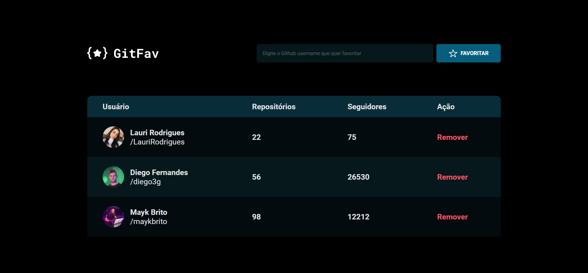

  

	
<h4 align="center"> 
	🚀 Projeto 15 | Stage 06 - GitFav
</h4>

  

  
  
  
  
   <a href="https://laurirodrigues.github.io/GitFav/"> ▶️ Visualizar Deploy </a>

<h2 align=left> 💻 Sobre o projeto </h3>

 Projeto realizado durante o programa <strong>Explorer</strong> da <a href="https://www.rocketseat.com.br/"> <strong>Rocketseat</strong> </a>. É o décimo quinto projeto do programa, localizado no nível 6, onde construímos uma página onde é possível favoritar usuários do GitHub para estudar conceitos de Assincronismo, Promises, POO, Classes, Herança, Polimorfismo, Imutabilidade, Método filter(), localStorage, API, fetch(), Desestruturação no JavaScript, Async functions e Try, catch e throw; 

  
<h2 align=left> 🛠 Tecnologias utilizadas </h3>

  
  
  

<h2 align=left> 🎨 Layout </h2>
<a href="https://www.figma.com/file/SzQA07HwmSPj4hOYgu1Pps/%5BDesafios-Explorer%5D-GitFav-(Copy)/duplicate"> Visualizar no Figma </a>  

<h4>💻 Desktop </h4>

